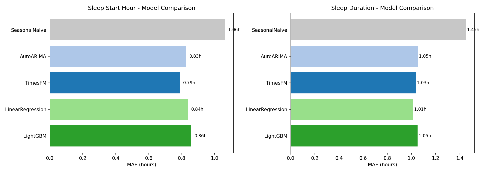
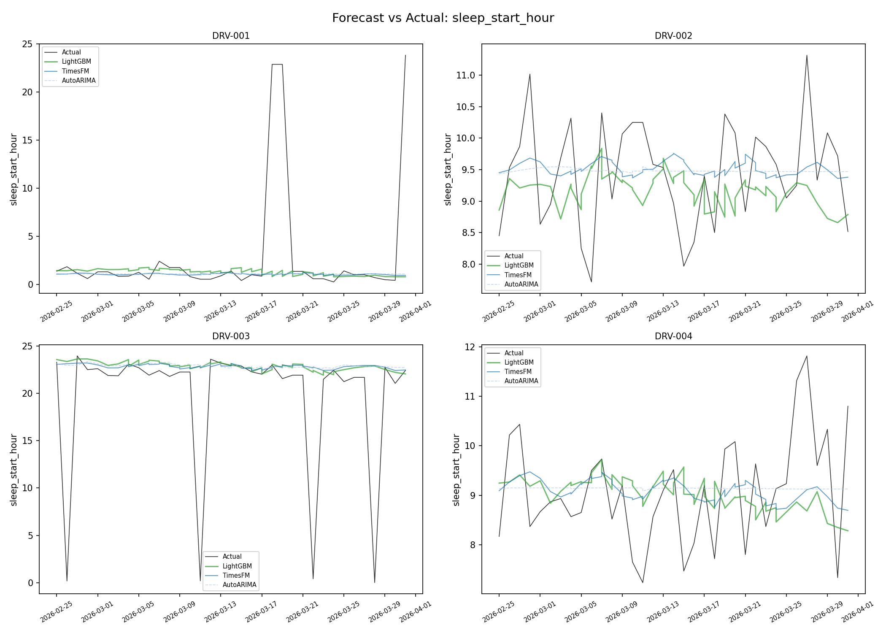
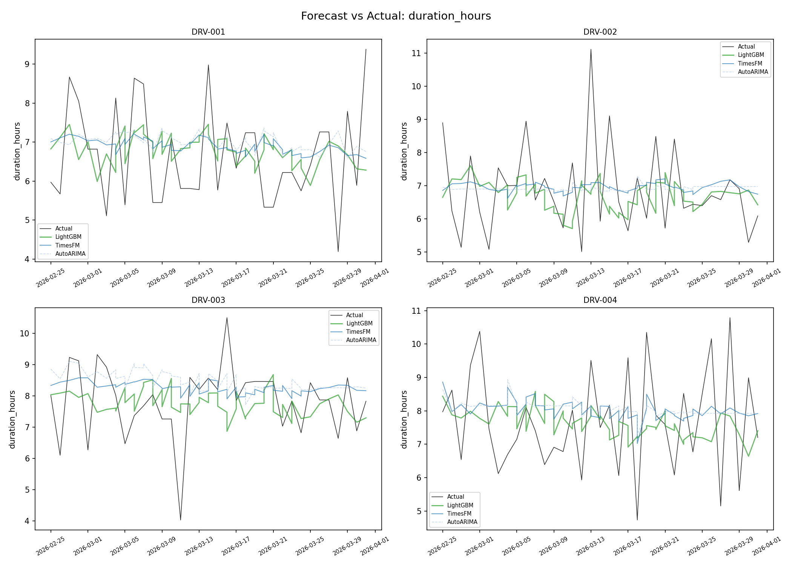
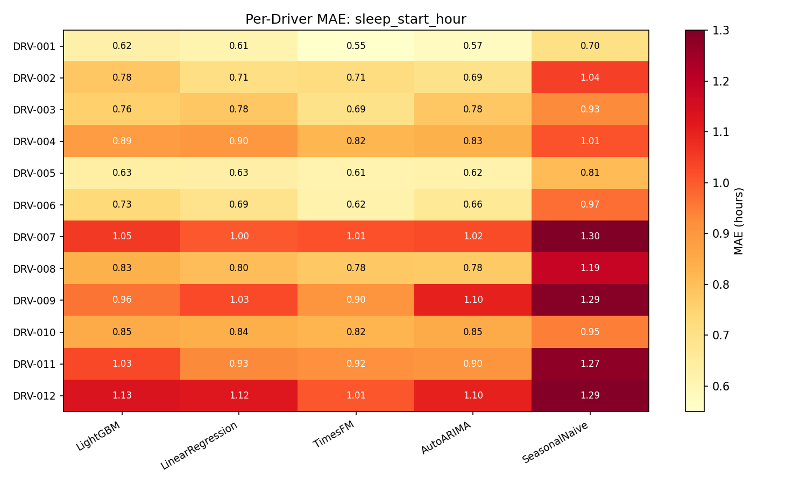
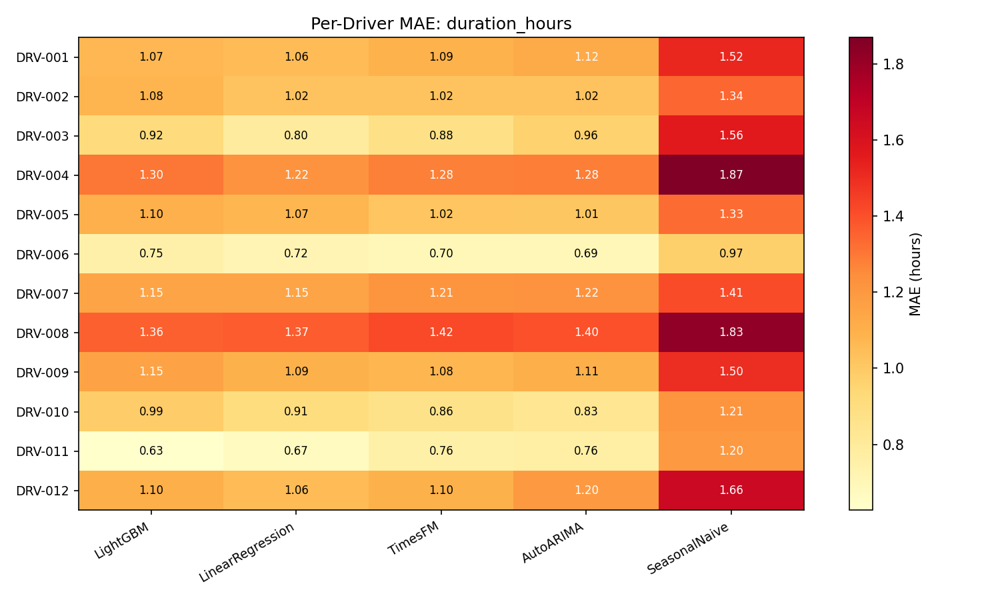

# Truck Driver Sleep Prediction

## What This Does

Predicts two things for each truck driver, 14 days ahead:
- **When they'll fall asleep** (start hour, 0–24)
- **How long they'll sleep** (duration in hours)

Uses 1 year of GPS telemetry from 12 drivers across 15 US cities, mixing
day-shift, night-shift, and split-shift drivers.

## Models

| Model | Why |
|-------|-----|
| **LightGBM** (MLForecast) | Local replacement for TimeGPT. Uses calendar features, lag history, and rolling stats. Same Nixtla DataFrame format — swap one function call to use the real TimeGPT API. |
| **LinearRegression** (MLForecast) | Simple baseline with the same features as LightGBM to test if the complexity is worth it. |
| **TimesFM 200M** (Google) | Pretrained foundation model. No features needed — just feed it the raw time series. Tests whether a large pretrained model can compete without feature engineering. |
| **AutoARIMA** | Classical statistical model. Auto-tunes its own parameters. Benchmark for whether ML is needed. |
| **SeasonalNaive** | "Same as last week." If the models can't beat this, they're useless. |

## Results

All models beat the SeasonalNaive baseline; the best models land ~45 min–1 h
of mean absolute error on a target with std ~1.3 h.

| | Best Model | MAE |
|-|------------|-----|
| **Sleep start hour** (circular) | TimesFM | 0.79 h (~47 min) |
| **Sleep duration** | LinearRegression | 1.01 h (~61 min) |

SeasonalNaive: 1.06 h on start hour, 1.45 h on duration — everything else
clears that bar.

## Dataset Characteristics

The data generator is intentionally not a toy "22:00 every night" simulation.
Three shift archetypes, and each driver has drift, fatigue, and disruptions:

- **Day-shift** drivers sleep ~20:30–23:30.
- **Night-shift** drivers sleep mid-morning to afternoon (7:30–10:30 start).
- **Split-shift** drivers have bedtimes past midnight (0:30–3:30).

On top of the shift baseline, the generator layers in:

- **Weekly cycle** — longer, later sleep Thu/Fri/Sat.
- **Annual seasonality** — winter nights are up to ~1 h longer; summer wakes earlier.
- **Slow habit drift** — a bounded random walk on preferred bedtime across the year.
- **Sleep debt** — a short night tends to be partially repaid the next night.
- **Fatigue** — the rolling sum of the last 3 days' driving hours adds sleep.
- **Long-haul trips** every ~3 weeks, with a shorter pre-haul night and a longer recovery night.
- **Vacation window** — one ~1–2 week stretch per driver with later, longer sleep.
- **Disruption days** (~2 %) — weather / breakdowns / emergency loads that shake the schedule.
- **Late arrivals** push bedtime later for day-shift drivers.

The result: duration std ≈ 1.3 h (vs 0.4 h in the toy version), and sleep
start spans the full 0–24 h range with genuine midnight wraparound — so
circular encoding is doing real work rather than cosmetic.

## Plots

### Model Comparison

MAE in hours for each model, side by side for both targets. Shorter bar = better.



### Sleep Start Hour — Forecast vs Actual

Black line = actual. Colored lines = model predictions across CV windows for four drivers.



### Sleep Duration — Forecast vs Actual



### Per-Driver Error Heatmaps

Rows = drivers, columns = models. Darker red = higher error.





## Documentation

| Doc | Contents |
|-----|----------|
| [docs/SUMMARY.md](docs/SUMMARY.md) | Short summary — models, key techniques, takeaways |
| [docs/TECHNICAL.md](docs/TECHNICAL.md) | Full technical reference — data schemas, setup, directory structure |
| [docs/PIPELINE.md](docs/PIPELINE.md) | Pipeline diagrams — data flow, model routing, cross-validation |

## How to Run

```bash
python -m venv venv && source venv/bin/activate
pip install pandas scikit-learn matplotlib lightgbm mlforecast statsforecast
pip install torch --index-url https://download.pytorch.org/whl/cpu
pip install git+https://github.com/google-research/timesfm.git
pip install huggingface_hub safetensors einops

python generate_data.py   # generate synthetic data
python forecast.py        # run all models
python evaluate.py        # compute metrics + plots
```
